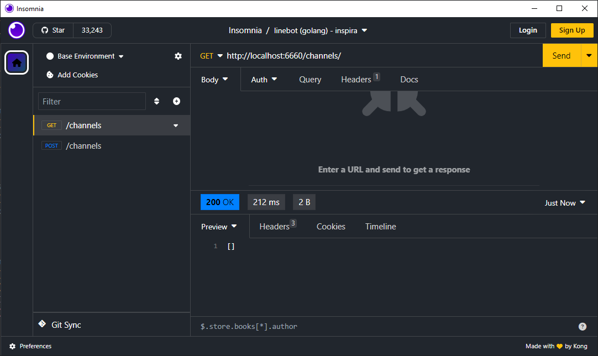
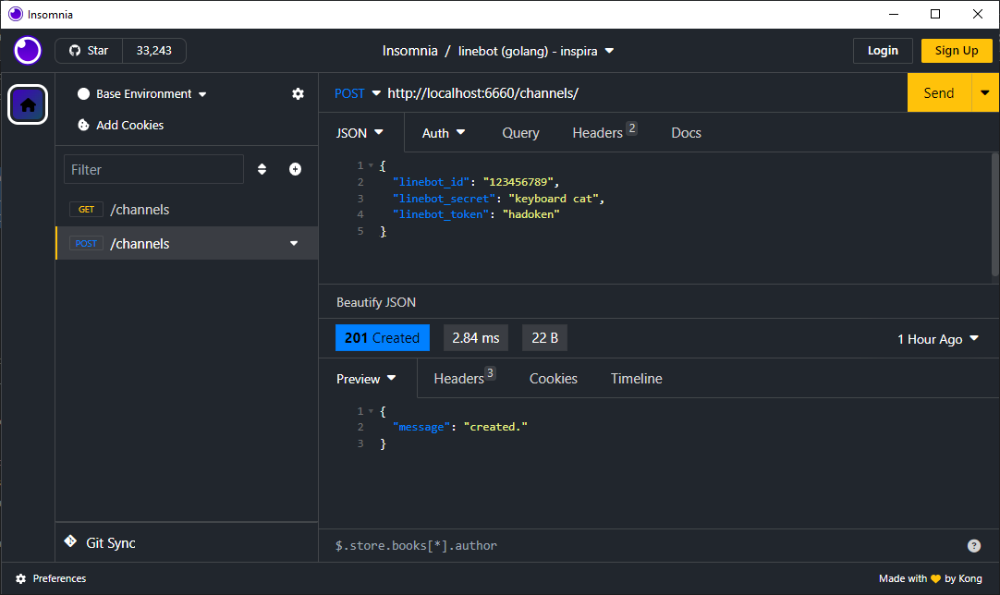

# linebot-ispira

### todo lists

- เพิ่ม update, delete สำหรับ in_memory 
- เพิ่มให้ใช้กับ database อื่นๆได้เช่น mongodb, firestore
- เพิ่มหน้า ui สำหรับจัดการ channel
- เพิ่ม command คำสั่งอื่นๆ สำหรับ linebot

### development tools

1. air (Live reload for Go apps)

    `$ go install github.com/cosmtrek/air@latest`

https://github.com/cosmtrek/air

2. ngrok (Ingress for Dev/Test) register and download free

https://ngrok.com/

---

### run (dev mode)

    $ air

---

channels

GET     `http://localhost:6660/channels/`

POST    `http://localhost:6660/channels/`

get all channel

    $ curl --request GET \
      --url http://localhost:6660/channels/

create channel

    $ curl --request POST \
        --url http://localhost:6660/channels/ \
        --header 'Content-Type: application/json' \
        --header 'User-Agent: Insomnia/2023.5.7' \
        --data '{
            "linebot_id": "123456789",
            "linebot_secret": "keyboard cat",
            "linebot_token": "hadoken"
        }'

---

linebot

POST    `http://localhost:6660/webhook/123456789`

---

